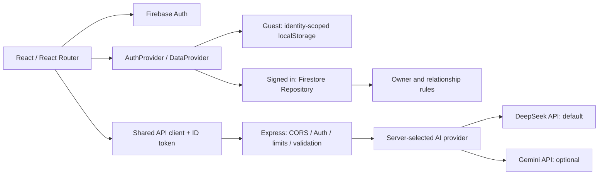
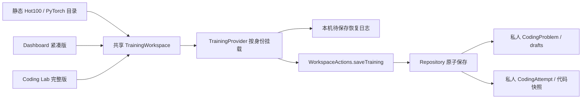

# Architecture

## 随网站发布的学习资料

`src/content/library/*-catalog.json` 和 `*-sources.json` 保存轻量目录与许可来源，`public/library/*.md` 保存经许可的教程快照；`learningLibrary.ts` 提供搜索、按篇读取、HTML 回退检测与私人笔记模板。`/library` 和 `/library/:resourceId` 独立于个人知识文章路由，绕过身份恢复和个人数据加载的阅读遮挡；尚未就绪的个人工作区不能保存笔记。所有引用保留出处；未确认全文许可的条目只有原站链接和原创学习提示。

公共资料不属于用户 Dataset，不进入 Firestore、备份、重置或访客 localStorage。用户主动选择“写学习笔记”才按现有 Repository 保存一条自己的笔记；稳定的独立笔记 ID 保证重复点击打开现有记录，不覆盖手写内容。完整 Markdown 不打入 JavaScript 首页包。

## 学习门户与阅读布局

全站使用 `Navbar` 顶部导航；桌面求职菜单和手机抽屉保留九个业务页面入口、快速新增、搜索、主题、语言与账号操作。`Dashboard` 在紧凑介绍区后直接挂载共享 `TrainingWorkspace`，随后保留知识分类、最近更新、真实复习、面试和投递状态。

`knowledgeCatalog` 汇总现有内置分类与用户自定义分类。分类入口使用 `/knowledge?category=...`，文章仍使用 `/knowledge/:articleId`；URL 保留筛选并支持刷新与返回。目录、正文和 TOC 分为独立展示组件，存储仍经过原有 Repository 与 WorkspaceActions。

界面语言由 `I18nProvider` 统一提供，默认简体中文，可在顶部和设置页切换英文。显示语言保存在浏览器偏好中，并同步同源标签页；翻译只作用于界面标签、已知应用错误和日期格式，不改变用户内容、状态枚举或备份数据。AI 新请求按所选语言回答，已有生成结果保留原文。

## 运行关系

Firebase Hosting 发布 `dist`，Render 运行编译后的 Express API。开发 Vite 挂载同一个 Express app。生产 Express 也能服务静态 SPA，用于本地验证与可选单服务运行。

## 责任边界

| 位置 | 责任 |
| --- | --- |
| `src/App.tsx` | 错误边界、Toast、Auth、Router、按身份重新挂载工作区 |
| `src/app/AuthProvider.tsx` | 单一认证观察者、初始化等待、登录退出错误 |
| `src/app/DataProvider.tsx` | 仓库加载、过期请求丢弃、保存成功后更新 UI、恢复/导出 |
| `src/app/WorkspaceActions.ts` | 级联删除、复习原子写入、面试真题转题库、显式资料初始化 |
| `src/app/AppRoutes.tsx` | URL 与原有页面 props 的适配，按页面懒加载 |
| `src/layouts/AppLayout.tsx` | 导航栏、侧边栏、搜索、主题、加载/失败显示 |
| `src/repositories/` | 类型契约、Zod 实体约束、local/cloud 实现和选择 |
| `src/services/backup.ts` | 备份格式、关系校验、访客恢复/重置 |
| `src/services/apiClient.ts` | API base、当前身份 token、超时和错误 |
| `src/server/` | 授权、配额、输入校验、AI 供应商选择与结构化输出校验 |
| `src/utils/` | 确定性 heading、frontmatter、纯复习调度函数 |

保留现有 pages，不为目录对称创建大型 framework。业务更复杂后再拆 Knowledge、AICopilot 等大页面。

## 路由

`/dashboard`、`/knowledge[/:articleId]`、`/questions[/:questionId]`、`/review`、`/coding[/:problemId]`、`/applications[/:applicationId]`、`/interviews[/:interviewId]`、`/copilot`、`/settings`。

复习特定题用 `/review?question=ID`，快捷新增用 `?new=1` 并在消费后移除。不存在的实体显示 Record not found。Copilot 临时提示词通过 router state 传递，不放入 URL。文章目录与正文共用 Markdown AST heading 插件，支持中文、重复与内联标题。

## 数据与持久化

九类数据：articles、questions、reviewHistory、codingProblems、codingAttempts、applications、interviews、interviewQuestions、mockSessions。实体仓库暴露 `list/save/remove`，跨实体业务用 `commit(Mutation[])`，避免半成功记录。

- 访客：`ai_career_os:guest:data` 中一个 JSON 快照，一次 `setItem` 成功后更新 React 状态；存储配额失败保留旧快照。只在 key 从未存在时生成学习资料，空集合不会重新填种子。
- 云端：保留原集合名 `knowledgeArticles`、`questions`、`reviewHistory`、`codingProblems`、`codingAttempts`、`applications`、`interviews`、`interviewQuestions`、`mockInterviewSessions`；查询均包含 `userId == uid`，使用 Firestore batch。每批上限 450 条，超过直接拒绝，无部分提交。
- 云端不将整份 Dataset 持久化为本地业务缓存；编程待保存草稿另有按账号隔离的本机恢复日志，不代表云保存成功，失败时也不写访客。账户切换重新挂载数据、页面与搜索，旧加载结果失效。
- 主题单独位于 `ai_career_os:<encoded-identity>:theme`。Google 登录态由 Firebase SDK 管理，不与业务备份混用。
- 复习 Question 与 ReviewHistory 同批写；面试真题升格 Question 与 InterviewQuestion.questionId 同批写。删除投递级联当前已加载的面试及真题，删除题目清理历史并解除真题关联。
- 多标签页/设备同时编辑仍是最后写入者获胜；当前没有实时订阅、冲突版本或数据库触发级联。UI 暂阻止同一工作区的重叠提交。规则保证所有者与写入时的关联，但不阻止拥有者在外部客户端删除父记录后留下孤儿。

## 数据兼容与迁移

云端集合和字段保留，无数据库迁移脚本。旧的不完整记录会触发可见校验错误，不能静默当成成功读取；先备份、修复具体记录后重试。部署加强版 rules 前检查自己的历史孤儿记录，特别是原型生成的 `applicationId: manual`。

旧全局 `ai_career_os_*` key 无法可靠确定归属，因此不自动迁移，也不删除。最好在原型版本导出 v1.0 备份，再恢复到访客；该版本同时接受 v1.0/v2.0。若旧版本已不可用，可在浏览器开发者工具保留这些 key 的原文后离线整理为符合 schema 的备份，先修复缺失关联，再导入。不要直接把旧数据归给最后登录的云账号。

恢复会将业务记录 userId 重绑定为 guest，保留实体 ID/关联，完整校验后一次性写入。云导出重新读取 Firestore，但九个查询不是一个跨集合时间点快照；多端编辑期间的严格一致备份及云恢复留待后续设计。

原有 `firebase-applet-config.json` 是旧公开客户端配置，`firebase-blueprint.json` 是原型说明；运行时均不读取。实际配置来自环境变量，实体约束以 `repositories/schemas.ts` 和 Firestore rules 为准。

## AI 边界

浏览器不导入模型 SDK 或 Admin SDK。`apiClient` 校验登录身份并携带 ID token；Admin 验证 token（包括撤销检查）后检查 UID allowlist。`AI_PROVIDER` 默认为 `deepseek`，`DEEPSEEK_MODEL` 默认为 `deepseek-flash`（当前为 DeepSeek-V4.1-Flash）；只有显式设置 `AI_PROVIDER=gemini` 才使用原 Gemini 配置。模型由服务端环境变量决定，结果展示实际 `modelUsed`。

DeepSeek 通过服务端原生 fetch 调用固定官方地址。Standard / Deep / Fast 均使用同一个 DeepSeek 模型并关闭 thinking，输出上限 4096 tokens，超时 30 秒；不会自动重试或改用另一付费供应商。结构化结果使用 JSON 模式、提示词中的字段约束和 Zod 验证。Gemini 档位仍可通过 `GEMINI_MODEL` / `GEMINI_PRO_MODEL` / `GEMINI_LITE_MODEL` 分别配置。

公开 `GET /api/capabilities` 只返回 `provider`、`model`、`webSearch`、`configured`，供 UI 展示配置与可用功能；不调用模型、不返回 Key，也不替代认证或实际连通检查。DeepSeek 接入禁用联网搜索，并在服务端拒绝该请求；Google grounding 仅供显式选择的 Gemini 使用。

无 token/无效 token 为 401，未授权 UID 403，未配置服务 503，输入不合法 400，超配额 429，模型失败 502。Provider 错误不把凭证/请求内容发送回浏览器。不伪造联网引用；JD 可关联标题必须属于本次提交的实际标题集合。完整本地知识检索与引用传参仍属下一阶段，不称为 RAG。

## 课程导航与内容诊断（本轮预览）

资源身份与课程位置分离。`imported-catalog.json` / `linked-catalog.json` 保持原 ID 与正文；`supplemental-catalog.json` 单独声明本站原创教材。人工编排的 `learning-paths.json` 可以多次引用同一资源，绝不复制正文；`source-courses.json` 与 `source-structure.json` 根据固定上游版本的目录/frontmatter/站点导航构建来源树。`libraryCourses.ts` 负责自然排序、祖先与面包屑、语言版本映射和课程内上下篇。

`/library` 默认路线视图，`view=source` 切换来源课程，具体 `course`、`source`、`lang` 和搜索筛选保存在 URL。左侧树是课程层级，右侧是当前 Markdown 的标题层级；当前祖先自动展开，正文链接继续携带阅读上下文。手机使用独立折叠面板。`content-review.json` 保存人工完整性判断，`content-health.json` 保存本地文件、构建、线上和来源校验的证据。原文提纲、原站链接、完整原文、本站补充和运行时加载失败分别呈现；正文加载器拒绝 HTML fallback，图片失败保留说明与原链接。

维护命令与逐资源结果见 `CONTENT_SOURCES.md` / `CONTENT_GAPS.md`。完整性不能只凭字数认定；重新导入不会自动覆盖人工学习路线或新增原创教材。

## 首页与 Coding Lab 的共享训练（本轮预览）

公共 114 项任务按需加载，不自动向访客或账号写入题库。只有编辑、显式保存或记录练习才创建该身份的题目快照。新快照 ID 为 `training-` 加身份、任务 ID、语言元组的 SHA-256；attempt 的 `problemId` 指向该私人快照，与现有 Firestore 所有者和父引用规则一致。原有私人题目、ID、练习记录与 `/coding/:problemId` 链接继续可用；公共任务也支持 `/coding/:taskId?track=...`。

`CodingProblem.drafts[language]` 保存代码、更新时间与计时；`CodingAttempt` 可选补充语言、错误原因、本人记录的执行依据，并保存当次代码。全是兼容性新增字段，九类 Dataset/集合、备份版本与规则不变。完成/待复习来自该题最新一条真实记录，题数按任务去重，保存草稿不计练习。

`TrainingBoundary` 随账号或数据恢复版本重新挂载。输入同步写入按 identity/task/language 隔离的本机恢复日志，1.8 秒防抖后走同一 Repository，显式保存立即进入顺序队列。账号保存失败不会写进访客仓库，也不会显示云保存成功；恢复日志是待同步的保护副本，不是第二套云数据。没有设备间实时合并，多端仍最后写入者获胜。

导出前等待队列，并把当前及刷新后尚未打开的待保存草稿写入仓库；任何失败阻止导出成功。访客恢复/重置清除该身份恢复日志，刷新数据使编辑器代次失效。`saveTraining` 在异步生成 ID 前捕获 `DataProvider.generation`，提交前再次校验，防止重置过程中旧保存重新写回。禁用浏览器存储时公共阅读仍可使用，私人训练显式显示失败。

代码编辑与记录没有远程执行 API。参考实现单独读取、展示，不覆盖草稿。公共 Python 训练下载 `solution.py` / `test_solution.py` 后由学习者在本地运行；旧私人题保留原语言及对应草稿分区，代码按语言下载为 `Solution.java`、`solution.cpp` 等文件。手动“本地样例通过”或“力扣 Accepted”明确标记本人记录。维护者 Python/PyTorch 测试只运行受控的仓库参考代码和反例，与浏览器用户输入无关。
