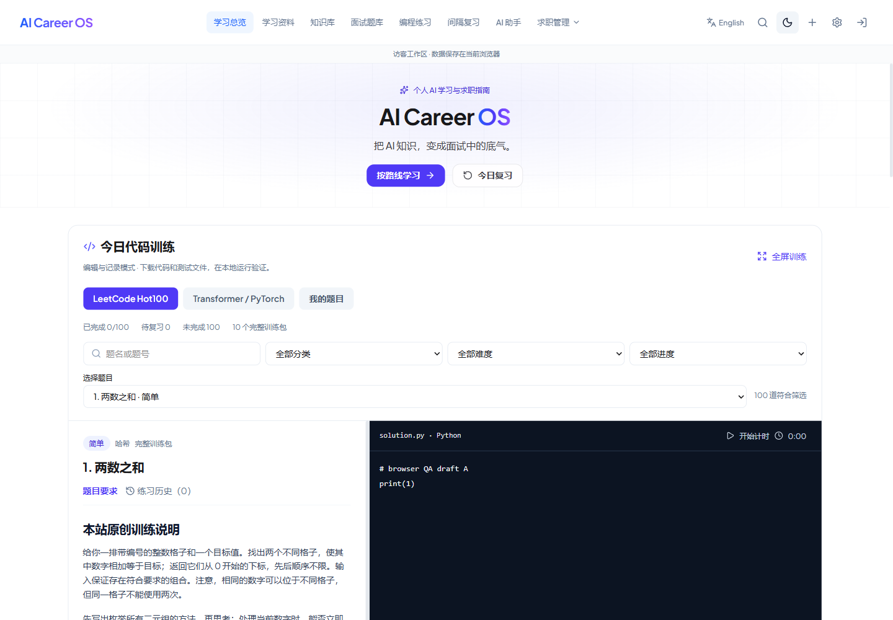
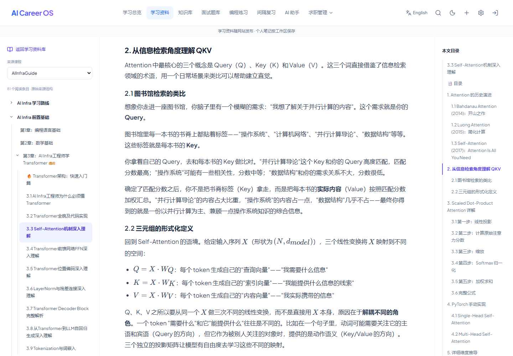

# 课程资料库与首页双轨训练交付报告

日期：2026-09-25。交付范围：可审查代码与本地预览；本轮没有发布 Firebase Hosting、修改生产数据、合并分支或改建认证/AI 服务。

## 基线与线上核查

- 开始分支：`refactor/codex-foundation`，提交 `110fe393e48f6ae25d48bd070a949f2931370653`，工作区干净。没有退回需求文档中仅用于定位的旧提交，也没有从旧 main 重做。
- 本轮审查分支：`feat/library-curriculum-training`，从上述基线新增，不改写基础分支历史。
- 开始工作时核对现有 Firebase 两个域名的路由、首页构建文件与静态正文，响应及 SHA-256 与上一轮已验证的本地构建一致。该产品构建对应 `d318f8f`；`110fe39` 仅在其上补充测试修正。Firebase 页面没有嵌入 Git SHA，因此这是构建字节匹配证据，并非由页面直接读出的提交号。
- 既有 151 份上游正文逐项在线读取，全部 HTTP 200、与本地 SHA-256 匹配，没有 Markdown 请求被返回 HTML 的现象。最后正文核查时间为 `2026-09-25T05:58:12.452Z`。逐项结果见 [CONTENT_GAPS](CONTENT_GAPS.md)，本地原始记录在 `output/library-content-audit.json`、`output/hosting-verification.json`。
- 本轮没有收到新的参考图片附件；使用需求文件描述的课程层级和原先提供的站点参考，不声称检查了未收到的截图。

## 内容缺口与实际数量

旧说明中的“151 篇全文”把提纲和语言版本也计算进去了。原文没有部署丢失，真正的问题是目录较平、完整程度未区分，以及学习材料尚未接到可验证的代码训练。

| 内容状态 | 资源版本数 | 独立主题数 | 本轮处理 |
| --- | ---: | ---: | --- |
| 上游完整原文 | 116 | 81 | 原文件、ID、许可证和 provenance 不变，按原课程组织 |
| 上游提纲 | 35 | 35 | 保留原文，标注提纲，并指向同章实质内容/独立补充 |
| 原站入口 | 29 | 29 | 明确为链接，没有复制未授权全文 |
| 本站补充教学单元 | 6 | 6 | 与上游分开署名，配套可运行 CPU 示例与训练 |
| 合计 | 186 | 151 | 中文优先；双语版本不重复计算知识点 |

116 个完整原文版本由 AIInfraGuide 46 篇和 ARIS 35 组中英文教程（70 个版本）构成。加上 6 篇本站补充后，站内有 **122 个完整教材版本、87 个完整教材主题**；另有 35 篇站内提纲，总 Markdown 正文文件为 157。来源许可说明文件不计教材。

6 个单元是 Tensor shape/广播、Scaled Dot-Product Attention、MHA/causal/padding mask、RoPE、Norm/Residual/FFN/Decoder、GQA/KV Cache。已有上游长教程仍优先保留和互链；新单元补充与本站 14 项练习一致的 shape、数值/行为约定、最小代码与测试链，不冒充原作者续写。第三方许可证原样保留，本站原创本轮未另行指定再分发许可。

本地与最终构建的全部正文匹配，文件/HTML fallback/哈希错误均为 0。六个新单元本轮未部署，不能在当前正式网站读到；上游其余提纲仍然是提纲，29 个入口仍需打开原站。

## 课程与阅读实现

默认 8 条本站学习路线；来源课程视图根据固定上游的目录、frontmatter 与导航结构组织。`source-courses.json` 与人工 `learning-paths.json` 分开，来源没有可靠层级的条目保留“待归类”。

沿用 `Library`、`LibraryOverview`、`LibraryTree`、`LibraryContents`、Markdown/KaTeX。左课程树、中文自然排序、祖先展开和当前高亮；中正文与面包屑；右当前文章 TOC，深层标题可折叠。上下篇跟随当前课程，语言版本映射保持 topic 身份；筛选/语言/hash/历史恢复均进入验证。移动端两侧折叠，代码块与表格在自身容器内滚动；图片失败保留替代说明和原链接。

## 双轨训练与数据

| 轨道 | 核验/可编辑任务 | 完整原创训练包 | 实测 |
| --- | ---: | ---: | --- |
| 力扣 Hot100 | 100（官方 17 分类） | 10 | 100 骨架语法/签名核查；26 个 Python unittest |
| Transformer / PyTorch | 14 | 14 | 49 个 CPU 数值与行为测试；14 空骨架被拒绝；5 错误变体被识别 |

Hot100 官方名单、题号、链接和 Python 接口来自公开学习计划/元信息快照；没有混入面试150，没有复制官方题解、受限题面或私有测试。其余 90 题明确为“索引与骨架”，可编辑、保存、记录，本站讲解/参考/测试包尚未补齐。10 道完整题：1、283、3、560、53、206、94、200、20、70。固定来源与复现见 [HOT100_VERIFICATION](HOT100_VERIFICATION.md)。

PyTorch 14 题包含形状、稳定 softmax、embedding、attention、mask、MHA、norm、FFN、residual、sinusoidal、RoPE、decoder、KV cache、GQA；针对数值、梯度、mask 语义、未来扰动、offset、全遮蔽与分块/逐 token 增量一致性验证，详见 [PYTORCH_TRAINING_VALIDATION](PYTORCH_TRAINING_VALIDATION.md)。六个教材示例也实际运行通过。

首页紧凑版与 `/coding` 完整版使用同一 `TrainingWorkspace` / `TrainingProvider`；公共目录和参考代码按需加载，不预先创建 114 条私人记录。草稿按身份、task ID、语言隔离，编辑先保存本机恢复日志，1.8 秒防抖写入现有 Repository；显式保存可立即提交。访客仅当前浏览器保存，登录账号走原有 Firestore Repository，失败不伪装云同步成功。

新公共任务首次编辑/保存才建立私人 `CodingProblem` 快照，`drafts[language]` 保存代码/时间/计时；`CodingAttempt.problemId` 引用这个快照，原子保存本次代码、自评、复盘与执行依据。原私人题和历史链接兼容。完成题数按不同任务的最新真实记录计算；保存草稿不增加练习次数。

导出备份前保存当前和未重新打开的恢复草稿；失败阻止导出成功。重置/恢复使旧保存代次失效，不能把已重置代码写回来。备份格式、9 类集合和 Firestore 安全规则保持兼容，没放宽所有者/父记录约束。

没有在线执行器、远程 Python 入口或自动 Accepted。参考答案展示在独立区域，不覆盖代码；下载脚本和公开测试后在本地 CPU 验证，手动记录的结果明确是本人声明。

## 实际验证

| 检查 | 结果 |
| --- | --- |
| `npm run lint` / `npm run typecheck` | 通过；两者目前都是 TypeScript 检查 |
| `npm test` | 20 个测试文件、139 项通过 |
| `npm run test:emulator` | 6 项通过；demo-career-os，含私人任务+attempt 原子关联、跨 UID 拒绝 |
| `npm run build` | Vite 前端及 esbuild 服务端通过 |
| `node scripts/audit-learning-library.mjs` | 186 项逐项诊断；本地/构建错误 0；复用此前 `--online` 核查记录，既有线上正文 151/151 匹配；重新请求线上正文需加 `--online` |
| `python scripts/verify-hot100.py --run-references` | 100 个骨架、10 包/26 测试通过；Python 3.14 和 3.12 均实测 |
| 项目 venv Python + `validate_references.py --negative-checks --tutorial-checks` | Python 3.12.14 / torch 2.14.0+cpu；49 正例、14 空骨架、5 错误变体、6 教材示例全部达到预期 |

CI 保留安装、类型、应用测试、规则、构建、生产服务 smoke；新增 Hot100 标准库检查和独立 CPU PyTorch job。没有把受控参考代码测试当作网页用户代码执行。

过程中实际修复：禁用 localStorage 会阻断公开资料的问题、立即导出漏掉防抖/刷新恢复草稿、异步 ID 生成期间重置后旧草稿重新写回，以及旧 Java/C++ 私人题语言和草稿分区的兼容性。一次模拟器初始化因进程 HTTP 代理路由 localhost 失败，移除该进程代理后 6 项通过。一次并行高负载全套检查出现旧用例超时和尚未集成教材 ID，等待集成完成后正常全套通过；未放宽超时或删除断言。

## 浏览器与截图

使用 Playwright CLI 驱动本机 Chromium，独立会话 `career-training` / `career-library-qa`；均访问本地生产构建 `http://localhost:3100`，验收数据只在隔离浏览器。不是正式站点写入，也不是实际 Google 账号同步验收。

已完成训练验收：Hot100 A/B 交替编辑和刷新、首页/完整页同一草稿、答案不覆盖代码、真实保存与刷新恢复练习、PyTorch 切换/刷新、测试文件下载且 SHA 与源码一致、MHA 教材 → 练习 → 首页继续 → 保存一次 Partial 记录。1440 首页编辑器顶部约 728px，1024/390 页面没有整体横向溢出；手机深浅色均截图检查。例行测试覆盖 guest/A/B 隔离、账号保存失败、导出和重置竞争，但没有实际云账号登录。

本地截图在 `output/playwright/`（不提交测试浏览器数据）：

- `training-dashboard-1440-light.png`
- `training-workspace-1024-light.png`
- `training-editor-390-light.png` / `training-editor-390-dark.png`
- `training-home-history-390-dark.png`

课程浏览器已确认：来源课程的第 1–11 章自然排序、当前节点和祖先展开、中文标题 hash 目录高亮及刷新、下一篇后返回恢复原 hash。ARIS 中/英两个正文都返回 200，切换保留 q/course/view。1440/1024/390 视口 scrollWidth 分别等于视口宽度；1440 正文约 800px、17px 字号/30.6px 行高，手机正文约 350px、16px 字号。手机左右导航分别折叠，展开课程后可在面板内滚动找到当前文章。课程浏览器控制台无错误或警告；完整记录在 `output/playwright/library-qa-report.md`。

精选截图（本地验收数据，不是线上页面）：

[390px 深色阅读](screenshots/library-reader-390-dark.png) · [390px 深色编辑](screenshots/training-editor-390-dark.png)。更多 1024/390 和交互截图留在 `output/playwright/`；四张精选图随此报告提交。训练浏览器控制台检查无错误或警告。

## 未核验与已知边界

- 本轮不配置或调用生产 Firebase Auth/Firestore、DeepSeek；真实账号多设备同步仍未验收。规则验证使用本地模拟器，身份交互回归使用 mock Auth。
- 没有实际手机硬件/Safari/软键盘测试；390px 为桌面 Chromium 视口模拟。
- 没有执行或评测用户代码，没有把公开样例视作完整在线判题。
- 不宣称所有上游代码都已运行或事实全部复核；本轮完整性诊断是对内容形态与发布完整性的核查。
- 账号多设备同时改同题仍最后写入者获胜，无实时协作或冲突合并。
- Hot100 余下 90 题与上游未完章节的完整教学包仍未补齐，界面如实标识。
- 手机首次展开较长课程面板时，当前条目有时位于面板底沿之外；祖先已展开且有高亮，需在面板中稍向下滚动。未对每篇上游文章、所有第三方图片和所有外链逐一做人工浏览器验收；文件完整性另有全量自动核验。

## 主要变更文件

- 课程：`src/components/library/*`、`src/pages/Library.tsx`、`src/services/libraryCourses.ts` / `libraryTrainingLinks.ts` / `learningLibrary.ts`，课程/审核/补充 JSON；`scripts/build-library-courses.mjs` / `audit-learning-library.mjs`。
- 训练：`src/components/training/*`、`src/app/TrainingProvider.tsx`、`src/services/trainingCatalog.ts` / `trainingWorkspace.ts`、`src/repositories/trainingRecovery.ts`；首页和 Coding Lab 接入，共享 DataProvider/WorkspaceActions、可选字段 schema 与备份恢复。
- 内容：`src/content/training/*`、`public/training/*`、`public/library/career-*.md`；Hot100 抓取/验证脚本。
- 验证：训练数据、组件、资产、Hot100、课程、导航回归及 Firestore 关联测试；`.github/workflows/ci.yml`。
- 文档：本报告、计划、CONTENT_GAPS/SOURCES、ARCHITECTURE、Hot100/PyTorch 实测及预览/发布说明。

## 预览、发布与回滚

本轮交付的本地预览：`http://localhost:3100/library`、`http://localhost:3100/dashboard`。复现可执行 `npm ci`、上述检查、`npm run build`，再在 PowerShell 设置 `$env:PORT='3100'; $env:NODE_ENV='production'; npm start`。访客数据按 origin 隔离，换端口不代表草稿丢失。

正式发布需要用户另行明确要求。届时确认审查提交及现有公开构建配置、备份自己的访客数据，重跑检查并 `npm run build`；沿用 [DEPLOYMENT](DEPLOYMENT.md) 的现有 Hosting target，仅发布该站点。若要公开预览也先确认，再用独立预览 channel，不能把本地截图当成已发布预览 URL。本轮无需数据库迁移或更新规则，不要借发布训练内容覆盖云数据。

回滚使用 Firebase 上一个 Hosting release 或基线 `110fe39` 的相同配置重建；保留新私人草稿/attempt 字段与数据备份，不删除记录、不回退安全规则。旧 UI 不支持新草稿编辑，旧版本导出器可能不保留新增字段；回滚前应先由新版本导出完整备份。回滚只改变静态界面，不应清空浏览器、Firestore 或原文快照。
